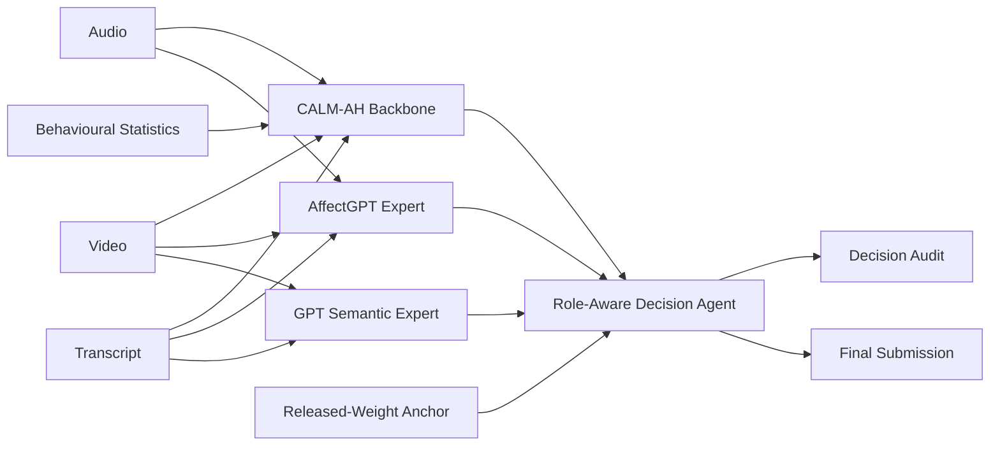

# CALM-AH: Role-Aware Multimodal A-H Classification

CALM-AH is a multimodal binary-classification pipeline for Ambivalence–Hesitancy (A-H) recognition in video. The repository combines a calibrated multimodal backbone, a historical anchor prediction, an AffectGPT-based affect expert, and a GPT semantic-reasoning expert through a role-aware decision agent.

The implementation is provided as a reproducible Jupyter notebook:

```text
ABAW11.ipynb
```

The notebook covers dataset reconstruction, multimodal feature extraction, released-model inference, model retraining, validation-only calibration, stability-regularized ensemble weighting, diagnostic analysis, external expert inference, and final submission generation.

> **Important:** Dataset files, third-party checkpoints, API credentials, and AffectGPT weights are not included in this repository.

---

## Overview

The system uses four prediction sources with intentionally different responsibilities:

| Source | Role | Default fusion weight |
|---|---|---:|
| **CALM-AH** | Primary calibrated multimodal classifier and reliability gate | 0.55 |
| **Released-weight anchor** | Historical stable prediction produced with the released ensemble weights | 0.15 |
| **AffectGPT Expert** | External multimodal affect judgment from video, audio, and subtitle inputs | 0.15 |
| **GPT Semantic Expert** | Independent semantic judgment from sampled video frames and transcript text | 0.15 |

These sources are **not** treated as four equal votes. CALM-AH has the largest weight and can activate a high-confidence veto.



---

## Main Components

### 1. CALM-AH multimodal backbone

The primary pipeline combines four feature families:

- **Text:** F2LLM embeddings and linguistic hesitation/ambivalence statistics.
- **Audio:** HuBERT embeddings and acoustic statistics such as energy, spectral features, silence ratio, and pitch.
- **Video:** face-aligned SigLIP2 representations, temporal derivatives, and frame-consistency statistics.
- **Statistics:** pooled behavioural and modality-level descriptors.

The released CALM-AH pipeline contains 15 modality combinations. Each base model has its own threshold, and their hard predictions are aggregated using learned ensemble weights.

### 2. Released-weight anchor

The anchor source applies the originally released CALM-AH ensemble weights to the retrained base-model probabilities. It provides a conservative historical reference and is kept separate from the newly optimized CALM-AH prediction.

### 3. AffectGPT Expert

`AffectGPTExpert` wraps an external AffectGPT inference process behind a common `PredictionExpert` interface.

The expert receives a manifest containing:

- submission ID;
- video path;
- audio path;
- subtitle or transcript.

The external runner must produce one prediction per video. The recommended output schema is:

| Column | Description |
|---|---|
| `submission_id` | Identifier matching the private manifest |
| `label` | Binary prediction: `0` or `1` |
| `probability_class_1` | Probability assigned to class 1 |
| `confidence` | Confidence in `[0, 1]` |
| `rationale` | Optional short explanation |
| `status` | Normally `ok` |
| `expert` | Normally `affectgpt` |

The adapter accepts several common aliases, including `prediction`, `class`, `prob`, `score`, `reason`, and `explanation`. Explicit numeric predictions are strongly recommended.

### 4. GPT Semantic Expert

`GPT56SolSemanticExpert` performs independent semantic reasoning using:

- uniformly sampled video frames;
- subtitle or transcript text;
- a task-specific binary-classification prompt.

It does **not** receive CALM-AH, anchor, or AffectGPT predictions. This preserves expert independence and reduces confirmation bias.

The model name is configurable through `GPT56_MODEL`. The notebook currently defaults to:

```text
gpt-5.6-sol
```

Replace this value with a compatible model available to your API account when necessary.

Predictions are written incrementally to a JSONL cache so interrupted runs can resume without repeating completed API requests.

---

## Role-Aware Decision Policy

The final `RoleAwareDecisionAgent` applies the following rules in order.

### Rule 1: CALM-AH veto

When CALM-AH confidence is at least `0.85`, its label is final:

```text
CALM-AH confidence >= 0.85
    -> CALM-AH high-confidence veto
```

### Rule 2: unanimous secondary override

If the veto is inactive, the anchor, AffectGPT, and GPT experts may override CALM-AH only when:

1. all three predict the same label;
2. that label is opposite to CALM-AH;
3. every secondary source has confidence of at least `0.65`.

### Rule 3: confidence-adjusted weighted vote

When neither the veto nor unanimous override applies, the system uses a confidence-adjusted weighted average.

For source \(i\):

```text
effective_weight_i = base_weight_i × (0.5 + 0.5 × confidence_i)
```

The final class-1 probability is the weighted mean of the four class-1 probabilities. The default decision threshold is `0.50`.

An exact tie is resolved using the CALM-AH label.

All policy values are defined in `FusionPolicy` and can be changed without modifying the expert implementations.

---

## Repository Layout

The notebook expects a structure similar to the following:

```text
.
├── ABAW11.ipynb
├── bah_metrics.py
│
├── CALMAH_v1/
│   ├── pipeline_meta.joblib
│   ├── model_<combination>.keras
│   └── model_<combination>.joblib
│
├── data/
│   ├── Videos/
│   ├── split/
│   │   ├── train.txt
│   │   ├── val.txt
│   │   └── test.txt
│   └── bah-video.csv                 # Optional label metadata
│
├── unlabel/
│   └── data/                         # Competition-private videos
│
├── labels/
│   ├── train.txt
│   ├── val.txt
│   ├── test.txt
│   └── unlabeled.txt
│
├── embeddings/
│   ├── text_embeddings.pkl
│   ├── audio_embeddings.pkl
│   └── video_embeddings.pkl
│
├── audios/                           # WAV files for AffectGPT
├── sub.xlsx                          # Video IDs and transcripts
│
├── abaw11_append_results/
├── abaw11_retrained_base_models/
├── abaw11_retrained_ensemble_weights_v1/
├── abaw11_released_weights_restored_v1/
├── abaw11_participant_question_diagnostics_v1/
└── outputs/
    └── expert_layer/
```

The current notebook validates the following split sizes:

| Split | Expected videos |
|---|---:|
| Train | 778 |
| Validation | 124 |
| Labeled test | 525 |
| Competition private | 152 |

---

## Environment

The notebook uses TensorFlow/Keras for parts of the CALM-AH pipeline and PyTorch/Transformers for feature extraction. A separate AffectGPT environment is recommended because its dependency versions may differ from the main environment.

### Main CALM-AH environment

A CUDA-enabled environment is recommended, although some stages can run on CPU.

Core dependencies include:

```text
python
jupyter
numpy
pandas
scipy
scikit-learn
joblib
tensorflow
keras
torch
transformers
sentence-transformers
lightgbm
librosa
opencv-python
Pillow
scikit-image
retina-face
tqdm
openpyxl
openai
```

Install versions compatible with your operating system, CUDA driver, and available checkpoints. The custom `bah_metrics` module must also be importable from the repository or `PYTHONPATH`.

### AffectGPT environment

Configure a separate Python executable containing the dependencies required by your AffectGPT implementation:

```bash
export AFFECTGPT_PYTHON=/path/to/affectgpt/environment/bin/python
export AFFECTGPT_ROOT=/path/to/AffectGPT
export AFFECTGPT_RUNNER=/path/to/AffectGPT/inference_expert.py
```

---

## Configuration

The notebook avoids user-specific paths. Most locations and execution switches can be configured with environment variables.

### Core paths

```bash
export PROJECT_ROOT=/path/to/repository
export OUTPUT_ROOT=/path/to/outputs
export HF_CACHE_ROOT=/path/to/huggingface/cache
export FEATURE_PYTHON=/path/to/CALMAH/environment/bin/python
export FEATURE_GPU=0
```

Default portable paths used by the notebook are:

```text
PROJECT_ROOT=/workspace/project
OUTPUT_ROOT=/workspace/outputs
HF_CACHE_ROOT=/workspace/cache/huggingface/hub
FEATURE_PYTHON=/opt/conda/envs/CALMAH/bin/python
```

### AffectGPT configuration

```bash
export AFFECTGPT_ROOT=/path/to/AffectGPT
export AFFECTGPT_PYTHON=/path/to/affectgpt/bin/python
export AFFECTGPT_RUNNER=/path/to/AffectGPT/inference_expert.py
export AFFECTGPT_AUDIO_ROOT=/path/to/wav/files
export TRANSCRIPT_TABLE_PATH=/path/to/sub.xlsx
```

The default external command is:

```text
{python} {runner} --manifest {manifest} --output {output}
```

Override it when the local runner uses different arguments:

```bash
export AFFECTGPT_COMMAND_TEMPLATE='{python} {runner} --manifest {manifest} --output {output}'
```

### GPT expert configuration

Set the API key outside the notebook:

```bash
export OPENAI_API_KEY='your-api-key'
```

Optional settings:

```bash
export GPT56_MODEL='gpt-5.6-sol'
export GPT56_REASONING_EFFORT='medium'
export GPT56_FRAME_COUNT=6
export GPT56_MAX_OUTPUT_TOKENS=400
export GPT56_MAX_RETRIES=3
export GPT56_RETRY_SECONDS=3
```

Do not commit API keys, access tokens, or local credential files.

---

## Running the Notebook

Open the notebook from the configured CALM-AH environment:

```bash
jupyter lab ABAW11.ipynb
```

Run the sections in order.

### Notebook stages

1. **Environment and shared configuration**
2. **Optional foundation-model feature extraction**
3. **Modality feature extraction**
4. **Load embeddings and assemble dataset matrices**
5. **CALM-AH pipeline**
6. **Current dataset reconstruction**
7. **Offline feature completion and audit**
8. **Released-pipeline inference and calibration**
9. **Retrained pipeline**
10. **Stability-regularized ensemble weighting**
11. **Dataset and error diagnostics**
12. **Released-weight restoration and verification**
13. **Expert agents and role-aware four-source decision**

External inference is disabled by default.

### Run AffectGPT

After adapting the AffectGPT paths and runner:

```bash
export RUN_AFFECTGPT_EXPERT=1
```

Then execute the expert section of the notebook.

To ignore an existing prediction file and rerun the expert:

```bash
export FORCE_RERUN_EXPERTS=1
```

### Run the GPT semantic expert

```bash
export OPENAI_API_KEY='your-api-key'
export RUN_GPT56_EXPERT=1
```

The expert writes each completed result to:

```text
gpt56_sol_cache.jsonl
```

This cache supports resumable execution.

### Run final four-source fusion

Only enable final fusion after both expert prediction CSV files have been generated and inspected:

```bash
export RUN_FINAL_FUSION=1
```

The final cell requires all four prediction sources by default.

---

## AffectGPT Runner Contract

A custom AffectGPT runner should accept:

```bash
python inference_expert.py \
  --manifest private_expert_manifest.csv \
  --output affectgpt_private_predictions.csv
```

The manifest includes at least:

```text
private_order
submission_id
video_id
video_path
audio_path
subtitle
```

A minimal recommended output is:

```csv
submission_id,label,probability_class_1,confidence,rationale
example.mp4,1,0.81,0.76,"Visible uncertainty and hesitant speech"
```

The notebook aligns output rows to the private manifest, checks for duplicate or missing IDs, validates probabilities and labels, and rejects failed predictions before fusion.

---

## Generated Outputs

### Dataset and feature audit

Typical files under `abaw11_append_results/` include:

```text
current_labeled_manifest.csv
current_private_manifest.csv
current_feature_coverage.csv
feature_provenance.csv
feature_schema_errors.csv
old_vs_current_dataset.csv
private_set_difference.csv
moved_splits_or_changed_labels.csv
offline_extraction_summary.csv
```

### Retrained model and ensemble artifacts

Typical outputs include:

```text
abaw11_retrained_base_models/
├── pipeline_meta.joblib
├── winner_probabilities_train_val.npz
├── winner_probabilities_test.npz
├── winner_probabilities_private.npz
└── base_model_training_summary.csv

abaw11_retrained_ensemble_weights_v1/
├── locked_primary_ensemble.joblib
├── locked_primary_ensemble.json
├── locked_weight_table.csv
├── validation_method_comparison.csv
├── locked_test_method_comparison.csv
└── trial-retrained-regularized-weights.txt
```

### Expert and final-decision artifacts

By default, the expert layer writes:

```text
outputs/expert_layer/
├── private_expert_manifest.csv
├── affectgpt_private_predictions.csv
├── gpt56_sol_private_predictions.csv
├── gpt56_sol_cache.jsonl
├── four_source_decision_audit.csv
└── trial-four-source-role-aware.txt
```

`four_source_decision_audit.csv` records, for every video:

- each source label;
- each source probability and confidence;
- whether the CALM-AH veto was active;
- whether a secondary override occurred;
- the final class-1 probability;
- the selected decision rule;
- the final binary prediction.

This audit file should be reviewed before submitting the final TXT file.

---

## Reproducibility and Leakage Controls

The notebook includes several safeguards:

- fixed random seeds;
- training-only preprocessing for retrained models;
- validation-only threshold and ensemble selection;
- locked configurations before labeled-test evaluation;
- SHA-256 checks for immutable source artifacts;
- explicit train/validation/test/private manifest alignment;
- split-overlap and duplicate-ID checks;
- source-specific prediction audits;
- resumable external-expert caches;
- independent GPT reasoning without access to other model predictions.

The verification section contains reference assertions for selected historical experiments. Small numerical differences may still occur across TensorFlow, CUDA, cuDNN, scikit-learn, and LightGBM versions.

---

## Data and Checkpoint Availability

ABAW data, released checkpoints, Hugging Face models, AffectGPT weights, and API access are governed by their respective licenses and access conditions. This repository does not redistribute those assets.

Before running the notebook, obtain the required data and checkpoints from their official sources and place them in the expected directories.

---

## Security and Privacy

- Never commit `OPENAI_API_KEY` or other credentials.
- Do not upload restricted competition data to a public repository.
- Review whether sending sampled frames or transcripts to an external API is permitted by the dataset license and your institution's ethics/privacy requirements.
- Add generated videos, embeddings, checkpoints, caches, and submissions to `.gitignore`.

A suggested `.gitignore` subset is:

```gitignore
.env
*.key
__pycache__/
.ipynb_checkpoints/

data/
unlabel/
labels/
embeddings/
audios/
sub.xlsx

CALMAH_v1/
abaw11_append_results/
abaw11_retrained_base_models/
abaw11_retrained_ensemble_weights_v1/
abaw11_released_weights_restored_v1/
abaw11_participant_question_diagnostics_v1/
outputs/

*.keras
*.joblib
*.pkl
*.npz
*.jsonl
```

Remove entries only when the corresponding files are explicitly permitted for redistribution.

---

## Limitations

- The full notebook requires substantial model and dataset storage.
- Feature extraction may require significant GPU memory and execution time.
- AffectGPT integration depends on a separately configured runner and checkpoint.
- GPT inference introduces API cost, latency, model-access requirements, and potential nondeterminism.
- The default fusion thresholds and weights should be validated before being applied to a different dataset or task.
- Confidence values produced by heterogeneous experts may not be perfectly calibrated against one another.
- The pipeline is designed for binary A-H classification and should not be assumed to generalize to other affective labels without retraining and validation.

---

## Citation

Citation information will be added after the associated method or challenge report is publicly available.

When using third-party models or datasets, also cite their original publications and repositories.

---

## License

No dataset or third-party model license is granted by this repository. Add a project-level `LICENSE` file before redistributing the source code, and comply with the licenses of ABAW, AffectGPT, Hugging Face checkpoints, and all other dependencies.
